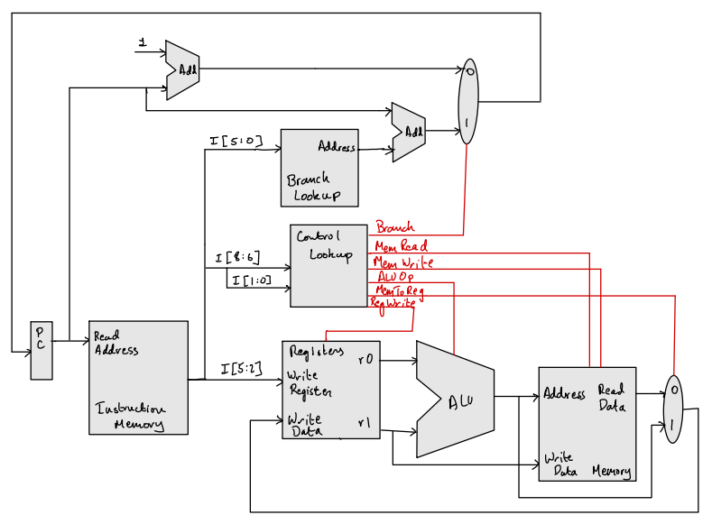
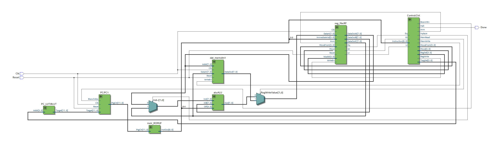

# ARMINx8
 **Another RISC Microprocessor Indeed**\
 \
[Video Explanation](https://youtu.be/0jN2UPsxYUo)\
ARMINx8 is a fully custom 8-bit microprocessor with a custom architecture.
While the architectural design intends on being a general purpose instruction set, this processor is programmed (through lookup tables) to specifically run three programs in `/asm`: `prog1.armin`, `prog2.armin` and `prog3.armin`

## Architecture

## ISA
With the aim of being a general purpose architecture, the primary goal during the design process was to maximize the instruction and register field bits. As such, (apart from specific ones) most instructions implicitly use the `$r0` and `$r1` as the `rs` and `rt` registers.
### Instruction Types 
| Type | Description                     | Machine Code Format                   | Example    |
|------|---------------------------------|---------------------------------------|------------|
| R    | Operate on Registers            | opcode (3'b) func (2'b) rd (4'b)      | add r4     |
| I    | Operate on Immediates           | opcode (3'b) imm (6'b)                | set 31     |
| M1   | Move any values to $r0 or $r1   | opcode (0'b100) rs (4'b) sel (2'bX0)  | movi r8 r0 |
| M2   | Move any values from $r0 or $r1 | opcode (0'b100) sel (2'bX0) rs (4'b)  | movo r1 r6 |
| B    | Branch Instructions             | opcode (3'b110) type (2b') imm (0'b4) | bgt 5      |
| H    | Halt                            | opcode (9'b111111111)                 | halt       |

The immediates are unsigned with their largest possible value being $2^6-1 = 31$. One detail to note here is that even though both the `I` and `B` instructions both use immediate values, the branch instruction values are treated differently by the assembler as they are only used to index into the branch look up table programmed in the processor. While this has allowed us to make absolute jumps to anywhere in the program (our range only limited by the instruction memory size), we only have the possibility of  having a maximum of $2^4 = 16$ branches in each program.
### Instructions
| Mnemonic | Type | Operation                         | Opcode/Funct (oct) |
|----------|------|-----------------------------------|--------------------|
| add      | R    | R[rd] = R[0] + R[1]               | 0/0                |
| sub      | R    | R[rd] = R[0] - R[1]               | 0/1                |
| and      | R    | R[rd] = R[0] & R[1]               | 0/2                |
| xor      | R    | R[rd] = R[0] ^ R[1]               | 0/3                |
| or       | R    | R[rd] = R[0] | R[1]               | 1/0                |
| not      | R    | R[rd] = ~ R[0]                    | 1/1                |
| rxor     | R    | R[rd] = ^ R[0]                    | 1/2                |
| lsl      | R    | R[rd] = R[0] << R[1]              | 1/3                |
| lsr      | R    | R[rd] = R[0] >> R[1]              | 2/0                |
| inc      | R    | R[rd] = R[rd] + 1                 | 2/1                |
| lwr      | R    | R[rd] = Mem[r0]                   | 2/2                |
| swr      | R    | Mem[r0] = R[rd]                   | 2/3                |
| set      | I    | R[rd] = imm                       | 3                  |
| movi     | M1   | R[sel] = R[s]                     | 4                  |
| movo     | M2   | R[d] = R[sel]                     | 5                  |
| bneq     | B    | if (R[0] != R[1]) PC = b_LUT[imm] | 6/0                |
| beq      | B    | if (R[0] == R[1]) PC = b_LUT[imm] | 6/1                |
| bgt      | B    | if (R[0] > R[1]) PC = b_LUT[imm]  | 6/2                |
| blt      | B    | if (R[0] < R[1]) PC = b_LUT[imm]  | 6/3                |
| halt     | H    | Send ACK signal                   | 7                  |

### Registers
This ISA supports 16 general purpose registers, of which `$r0` and `$r1$` are implicitly used as the `rs` and `rt` registers where applicable. To facilitate this we use the `movo` and `movi` instructions to move data in and out of the source registers.

## RTL Diagram

